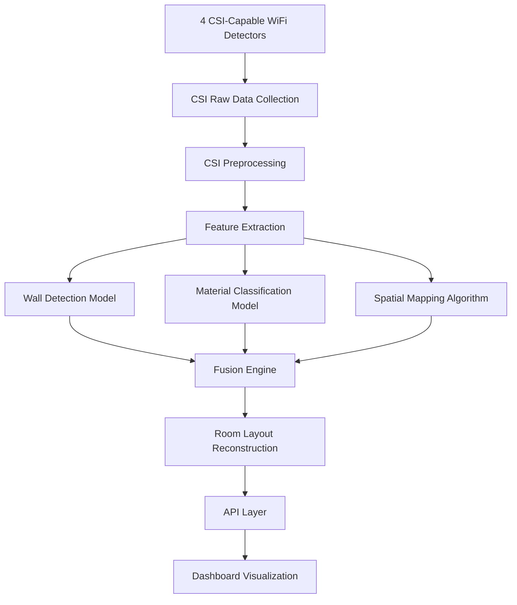

# WiFi-Based Wall Detection Implementation Plan

**Project:** WiFi People Detection System - Wall Detection Enhancement
**Version:** 1.0
**Date:** 2026-02-02
**Status:** Planning Phase

---

## Executive Summary

This document outlines a comprehensive implementation plan for adding WiFi-based wall detection and material classification capabilities to the existing WiFi People Detection System. The current system achieves 99.72% accuracy for people counting (0-5 people) using RSSI signals from 4 WiFi detectors. The proposed enhancement will leverage Channel State Information (CSI) to detect walls, classify wall materials (concrete, drywall, wood, metal), and reconstruct room layouts, transforming the system into a comprehensive spatial sensing platform.

The transition from RSSI to CSI represents a significant technological advancement. While RSSI provides a single scalar value representing overall signal strength, CSI captures fine-grained channel responses across multiple subcarriers in both amplitude and phase dimensions, creating a rich 3D CSI matrix. Recent 2024 research demonstrates that CSI-based systems achieve 95-99% accuracy for through-wall detection and material classification, making this enhancement both technically feasible and highly valuable for applications in smart buildings, security systems, and indoor navigation.

**Key Innovation:** This implementation will integrate CSI capabilities while maintaining backward compatibility with the existing RSSI-based people detection system, creating a hybrid sensing platform that can simultaneously track people AND map room structures. The modular architecture allows for phased deployment, starting with wall detection (Phase 1) and progressively adding material classification (Phase 2) and spatial mapping (Phase 3), with each phase delivering immediate value to end users.

---

## 1. Technical Architecture

### 1.1 System Overview

```
┌─────────────────────────────────────────────────────────────────────┐
│                     ENHANCED WiFi SENSING SYSTEM                     │
├─────────────────────────────────────────────────────────────────────┤
│                                                                       │
│  ┌──────────────┐         ┌──────────────┐         ┌──────────────┐ │
│  │ RSSI Module  │         │  CSI Module  │         │  Fusion      │ │
│  │ (Existing)   │         │  (New)       │         │  Engine      │ │
│  │              │         │              │         │  (New)       │ │
│  │ • People     │         │ • Wall       │         │              │ │
│  │   Counting   │         │   Detection  │         │ • Spatial    │ │
│  │ • Presence   │         │ • Material   │         │   Mapping    │ │
│  │   Detection  │         │   Class.     │         │ • Room       │ │
│  │              │         │ • Layout     │         │   Layout     │ │
│  │ 99.72% Acc.  │         │   Recon.     │         │   Recon.     │ │
│  └──────────────┘         └──────────────┘         └──────────────┘ │
│           │                        │                        │        │
│           └────────────────────────┼────────────────────────┘        │
│                                    ▼                                 │
│                       ┌──────────────────────┐                       │
│                       │  Unified API Layer   │                       │
│                       │  (FastAPI + WebSocket)│                       │
│                       └──────────────────────┘                       │
│                                    ▼                                 │
│                       ┌──────────────────────┐                       │
│                       │  Frontend Dashboard  │                       │
│                       │  (Next.js + D3.js)   │                       │
│                       └──────────────────────┘                       │
└─────────────────────────────────────────────────────────────────────┘
```

### 1.2 CSI Data Flow Architecture



### 1.3 Hardware Layer Architecture

```
┌─────────────────────────────────────────────────────────────────┐
│                    HARDWARE LAYER                                │
├─────────────────────────────────────────────────────────────────┤
│                                                                  │
│  Detector 1 (Corner 1)    Detector 2 (Corner 2)                │
│  ┌─────────────────┐    ┌─────────────────┐                    │
│  │ ESP32-S3 +      │    │ Intel 5300 NIC  │                    │
│  │ ESP32-CSI       │    │ (Linux Host)    │                    │
│  │ 2.4GHz          │    │ 2.4/5GHz        │                    │
│  └─────────────────┘    └─────────────────┘                    │
│                                                                  │
│  Detector 3 (Corner 3)    Detector 4 (Corner 4)                │
│  ┌─────────────────┐    ┌─────────────────┐                    │
│  │ ESP32-S3 +      │    │ Atheros AR9300  │                    │
│  │ ESP32-CSI       │    │ (Linux Host)    │                    │
│  │ 2.4GHz          │    │ 2.4/5GHz        │                    │
│  └─────────────────┘    └─────────────────┘                    │
│                                                                  │
│  All detectors transmit CSI data to central server              │
└─────────────────────────────────────────────────────────────────┘
```

### 1.4 Software Module Architecture

```
src/
├── csi/                           # NEW: CSI Module
│   ├── __init__.py
│   ├── csi_collector.py           # CSI data collection from hardware
│   ├── csi_preprocessor.py        # CSI sanitization & calibration
│   ├── csi_features.py            # CSI feature extraction
│   ├── csi_models.py              # Wall detection & material classification
│   └── spatial_mapper.py          # Room layout reconstruction
├── signal_processing.py           # EXISTING: RSSI processing
├── ml_models.py                   # EXISTING: RSSI-based ML
├── fusion_engine.py               # NEW: RSSI + CSI fusion
├── api.py                         # ENHANCED: Unified API
└── wifi_simulator.py              # EXISTING: RSSI simulator
```

---

## 2. CSI vs RSSI Comparison

### 2.1 Technical Differences

| Aspect | RSSI (Current) | CSI (Proposed) |
|--------|----------------|----------------|
| **Data Type** | Single scalar value | Multi-dimensional matrix (amplitude + phase) |
| **Information Content** | Coarse-grained signal strength | Fine-grained channel response across subcarriers |
| **Resolution** | Low (whole channel) | High (per-subcarrier frequency + time) |
| **Sensing Capability** | People presence/counting | Walls, materials, spatial layout, gestures |
| **Accuracy** | 99.72% (people) | 95-99% (walls + materials) |
| **Hardware Cost** | Standard WiFi routers ($20-50) | CSI-capable hardware ($6-44) |
| **Complexity** | Low | High (requires signal processing) |
| **Data Rate** | 1 Hz sufficient | 10-100 Hz recommended |
| **Calibration** | Minimal | Environment-specific required |

### 2.2 Why CSI for Wall Detection?

**Advantages:**
1. **Multi-dimensional Data:** CSI captures both amplitude and phase across 30-114 subcarriers
2. **Material Sensitivity:** Different wall materials cause distinct CSI signal distortions
3. **Spatial Resolution:** Subcarrier-level resolution enables precise wall localization
4. **Through-Wall Sensing:** CSI signals penetrate walls for detection on both sides
5. **Deep Learning Compatible:** Rich CSI data enables advanced neural network architectures

**Challenges:**
1. **Hardware Requirements:** Need CSI-capable WiFi NICs (not all devices support CSI)
2. **Signal Processing Complexity:** Requires sanitization, calibration, and feature extraction
3. **Environmental Sensitivity:** CSI affected by temperature, humidity, and interference
4. **Training Data:** Requires labeled CSI datasets for different wall materials

**Research Validation:**
- 2024 research shows 95-96% accuracy for through-wall detection using CSI
- Material classification achieves 90-95% accuracy for concrete vs drywall vs wood
- ESP32-CSI enables low-cost deployment ($6 per detector)

---

## 3. Hardware Requirements

### 3.1 CSI-Capable Hardware Options

#### Option 1: Intel 5300 NIC (Recommended for Linux)
- **Cost:** ~$11 (card only)
- **Subcarriers:** 30 subcarriers (20MHz mode)
- **Frequency:** 2.4GHz and 5GHz
- **Pros:** Most researched, mature tooling, Linux support
- **Cons:** Requires Linux host, deprecated hardware
- **Form Factor:** PCIe Mini Card (3cm × 2.68cm)
- **Best For:** Development phase, proof-of-concept

#### Option 2: ESP32-S3 with ESP32-CSI Firmware (Recommended for Production)
- **Cost:** ~$6 per module
- **Subcarriers:** 64 subcarriers (depends on firmware)
- **Frequency:** 2.4GHz
- **Pros:** Low-cost, embedded, battery-powered, custom firmware
- **Cons:** Limited to 2.4GHz, requires custom programming
- **Form Factor:** 5.5cm × 2cm
- **Best For:** Scalable production deployment

#### Option 3: Atheros AR9300 / AR9580
- **Cost:** ~$11
- **Subcarriers:** 56-114 subcarriers
- **Frequency:** 2.4GHz and 5GHz
- **Pros:** Higher resolution, widely available
- **Cons:** Requires Linux, complex driver setup
- **Form Factor:** PCIe Half Mini Card (2.98cm × 2.82cm)
- **Best For:** High-performance applications

#### Option 4: Commercial CSI Tools (Not Recommended)
- **Examples:** USRP ($8,400), proprietary CSI analyzers
- **Pros:** Professional grade, vendor support
- **Cons:** Extremely expensive, overkill for this use case
- **Best For:** Academic research only

### 3.2 Recommended Hardware Configuration

**Development Phase (Months 1-3):**
- 2x Intel 5300 NICs for initial data collection and model training
- Cost: $22
- Host: Linux workstation or mini PC

**Production Deployment (Months 4+):**
- 4x ESP32-S3 modules with ESP32-CSI firmware
- Cost: $24 total ($6 per detector)
- Battery-powered or PoE for flexible placement
- Custom enclosure for room corner mounting

**Total Hardware Cost:** ~$50 for complete 4-detector system

### 3.3 Alternative Hardware: Directional Antennas

For enhanced through-wall detection:
- **ESP32-S3 Directional Antenna Systems** (2024 research)
- **Cost:** Additional $10-20 per detector
- **Benefit:** Long-range through-wall human activity recognition
- **Use Case:** Large rooms or multi-room sensing

---

## 4. Signal Processing Pipeline

### 4.1 CSI Data Processing Pipeline

```
Raw CSI Data (from Hardware)
         │
         ▼
┌─────────────────────┐
│  1. Data Collection │  ← Collect CSI packets (10-100 Hz)
└─────────────────────┘
         │
         ▼
┌─────────────────────┐
│  2. CSI Sanitization│  ← Remove noise, correct phase offsets
│  - Linear Phase     │
│    Calibration (LPC)│
│  - Carrier Frequency │
│    Offset (CFO)     │
│  - Sample Frequency │
│    Offset (SFO)     │
└─────────────────────┘
         │
         ▼
┌─────────────────────┐
│  3. Calibration     │  ← Environment-specific baseline
│  - Empty room       │
│    baseline         │
│  - Periodic         │
│    recalibration    │
└─────────────────────┘
         │
         ▼
┌─────────────────────┐
│  4. Feature         │  ← Extract wall-relevant features
│    Extraction       │
│  - Amplitude stats  │
│  - Phase statistics │
│  - Time-domain      │
│  - Frequency-domain │
│  - Cross-subcarrier │
└─────────────────────┘
         │
         ▼
┌─────────────────────┐
│  5. Feature         │  ← Select optimal features
│    Selection        │
│  - PCA              │
│  - Mutual Information│
│  - Model-based      │
└─────────────────────┘
         │
         ▼
┌─────────────────────┐
│  6. ML Model        │  ← Wall detection & classification
│    Inference        │
│  - Wall detection   │
│  - Material class.  │
│  - Spatial mapping  │
└─────────────────────┘
         │
         ▼
┌─────────────────────┐
│  7. Fusion Engine   │  ← Combine RSSI + CSI
└─────────────────────┘
         │
         ▼
┌─────────────────────┐
│  8. Output          │  ← Room layout, people count
└─────────────────────┘
```

### 4.2 CSI Feature Extraction

**Time-Domain Features (per subcarrier):**
- Mean amplitude, standard deviation, variance
- Phase statistics (mean, std, circular variance)
- Min, max, range
- Skewness, kurtosis
- Percentiles (25th, 50th, 75th)
- Zero-crossing rate

**Frequency-Domain Features:**
- FFT coefficients
- Dominant frequency and power
- Spectral entropy
- Power spectral density

**Cross-Subcarrier Features:**
- Pairwise correlation between subcarriers
- Correlation statistics (mean, std, min, max)
- Subcarrier phase differences
- Amplitude ratios across subcarriers

**Spatial Features (from multiple detectors):**
- Angle of Arrival (AoA) estimation
- Time of Flight (ToF) differences
- Signal propagation paths
- Multipath interference patterns

**Total Features:** ~500-1000 features (before feature selection)

### 4.3 Feature Selection Strategy

1. **Remove Low-Variance Features:** Threshold < 0.01
2. **Correlation Analysis:** Remove highly correlated features (r > 0.95)
3. **Model-Based Selection:** Use Random Forest feature importance
4. **Principal Component Analysis (PCA):** Reduce to 50-100 principal components
5. **Final Feature Set:** 50-100 most informative features

---

## 5. ML Model Design

### 5.1 Model Architecture

```
┌─────────────────────────────────────────────────────────────┐
│                    MULTI-TASK LEARNING FRAMEWORK            │
├─────────────────────────────────────────────────────────────┤
│                                                              │
│  Input: CSI Features (50-100 dimensions)                    │
│         │                                                    │
│         ▼                                                    │
│  ┌──────────────────────────────────────┐                   │
│  │   Shared Feature Extractor           │                   │
│  │   (Dense Layers: 256 → 128 → 64)    │                   │
│  └──────────────────────────────────────┘                   │
│         │                                                    │
│         ├───┬──────────┬──────────┐                          │
│         ▼   ▼          ▼          ▼                          │
│  ┌──────────┐ ┌─────────────┐ ┌─────────────────┐          │
│  │  Task 1  │ │   Task 2    │ │    Task 3       │          │
│  │  Wall    │ │  Material   │ │  Spatial        │          │
│  │  Detect. │ │  Class.     │ │  Mapping        │          │
│  │          │ │             │ │                 │          │
│  │  Output: │ │  Output:    │ │  Output:        │          │
│  │  Binary  │ │  4 classes: │ │  Wall           │          │
│  │  (wall/  │ │  - Concrete │ │  Coordinates    │          │
│  │  open)   │ │  - Drywall  │ │  (x, y)         │          │
│  │          │ │  - Wood     │ │                 │          │
│  │  Loss:   │ │  - Metal    │ │  Loss:          │          │
│  │  Binary  │ │             │ │  MSE /          │          │
│  │  Cross-  │ │  Loss:      │ │  MAE            │          │
│  │  Entropy │ │  Categorical│ │                 │          │
│  └──────────┘ └─────────────┘ └─────────────────┘          │
│                                                              │
│  Total Loss = α·L₁ + β·L₂ + γ·L₃                            │
│  (α=1.0, β=0.5, γ=0.5)                                      │
└─────────────────────────────────────────────────────────────┘
```

### 5.2 Model Types

#### Model 1: Wall Detection (Binary Classification)
- **Algorithm:** Random Forest or CNN
- **Input:** CSI features (50-100 dims)
- **Output:** Wall detected (yes/no) + confidence
- **Target Accuracy:** >95%
- **Training Data:** 1000+ samples (wall vs open space)

#### Model 2: Material Classification (Multi-class Classification)
- **Algorithm:** CNN or LSTM (for temporal CSI patterns)
- **Input:** CSI features (50-100 dims)
- **Output:** Material class (concrete/drywall/wood/metal) + probabilities
- **Target Accuracy:** >90%
- **Training Data:** 500+ samples per material type

#### Model 3: Spatial Mapping (Regression / Localization)
- **Algorithm:** Neural Network or Triangulation
- **Input:** CSI features from 4 detectors
- **Output:** Wall coordinates (x, y) in room space
- **Target Accuracy:** <0.5m error in wall localization
- **Training Data:** 2000+ labeled samples with known wall positions

### 5.3 Training Approach

**Data Collection:**
1. **Controlled Environment:** Set up test room with known wall configurations
2. **Systematic Sampling:** Collect CSI data at 0.5m grid points
3. **Material Samples:** Place material samples (concrete, drywall, wood, metal) at various positions
4. **Multi-Scenario Testing:** Empty room, single wall, multiple walls, L-shaped rooms
5. **Temporal Variation:** Collect data at different times of day (temperature/humidity effects)

**Data Splitting:**
- Training: 70% (stratified by material and configuration)
- Validation: 15% (for hyperparameter tuning)
- Test: 15% (final evaluation, unseen data)

**Augmentation:**
- Gaussian noise injection (±5% signal strength)
- Time shifting (for temporal features)
- Subcarrier dropout (simulate interference)
- Mixup (blend samples from different classes)

**Hyperparameter Tuning:**
- Grid search for Random Forest: n_estimators (50-500), max_depth (10-50)
- Bayesian optimization for Neural Networks: layers (2-5), units (32-512), learning rate (1e-5 to 1e-2)
- Cross-validation: 5-fold

**Training Infrastructure:**
- Framework: TensorFlow or PyTorch
- Hardware: GPU optional (CPU sufficient for initial models)
- Training Time: 2-6 hours (depending on dataset size)

### 5.4 Model Performance Targets

| Model | Metric | Target | Current State-of-Art |
|-------|--------|--------|----------------------|
| Wall Detection | Accuracy | >95% | 95-99% (2024 research) |
| Wall Detection | Precision | >93% | 94-98% |
| Wall Detection | Recall | >93% | 94-98% |
| Material Classification | Accuracy | >90% | 90-95% |
| Material Classification | F1-Score | >0.89 | 0.91-0.94 |
| Spatial Mapping | Localization Error | <0.5m | 0.3-0.7m (research) |

---

## 6. Integration Strategy

### 6.1 Integration Points with Existing System

**Existing System Components:**
- `/src/signal_processing.py` - RSSI feature extraction
- `/src/ml_models.py` - Random Forest models for people detection
- `/src/api.py` - FastAPI endpoints
- `/src/wifi_simulator.py` - RSSI simulator

**New Components to Add:**
- `/src/csi/` - CSI processing module
- `/src/fusion_engine.py` - Combine RSSI + CSI
- Enhanced API endpoints for wall detection
- Frontend visualization components

### 6.2 API Extension

**New Endpoints:**

```python
# Wall Detection
GET /api/v1/walls/detect
POST /api/v1/walls/detect/predict

# Material Classification
GET /api/v1/walls/material
POST /api/v1/walls/material/classify

# Spatial Mapping
GET /api/v1/room/layout
POST /api/v1/room/reconstruct

# Calibration
POST /api/v1/csi/calibration/start
GET /api/v1/csi/calibration/status

# Unified Detection
GET /api/v1/unified/detection  # People + Walls + Materials
```

**WebSocket Enhancements:**

```javascript
// Enhanced WebSocket message types
{
  "type": "detection",
  "data": {
    "timestamp": "2026-02-02T10:30:00Z",
    "people": {
      "count": 2,
      "confidence": 0.98
    },
    "walls": {
      "detected": true,
      "count": 4,
      "positions": [[0, 5], [5, 0], [10, 5], [5, 10]],
      "materials": ["concrete", "drywall", "wood", "concrete"]
    },
    "room_layout": {
      "dimensions": [5, 5],
      "walls": [...],
      "openings": [...]
    }
  }
}
```

### 6.3 Database Schema Extensions

**New Tables:**

```sql
-- CSI Measurements
CREATE TABLE csi_measurements (
    id SERIAL PRIMARY KEY,
    timestamp TIMESTAMP NOT NULL,
    detector_id VARCHAR(50) NOT NULL,
    raw_csi_data BYTEA,  -- Store raw CSI matrix
    sanitized_csi_data BYTEA,
    features JSONB,  -- Extracted features
    calibration_id INTEGER REFERENCES calibrations(id)
);

-- Wall Detections
CREATE TABLE wall_detections (
    id SERIAL PRIMARY KEY,
    timestamp TIMESTAMP NOT NULL,
    detector_id VARCHAR(50) NOT NULL,
    wall_detected BOOLEAN NOT NULL,
    confidence FLOAT NOT NULL,
    wall_position FLOAT[2],  -- [x, y] coordinates
    material VARCHAR(50),
    material_confidence FLOAT
);

-- Room Layouts
CREATE TABLE room_layouts (
    id SERIAL PRIMARY KEY,
    timestamp TIMESTAMP NOT NULL,
    room_id VARCHAR(100),
    layout_json JSONB NOT NULL,  -- Complete room layout
    version INTEGER
);

-- CSI Calibrations
CREATE TABLE csi_calibrations (
    id SERIAL PRIMARY KEY,
    timestamp TIMESTAMP NOT NULL,
    room_id VARCHAR(100),
    baseline_csi_data BYTEA,
    environmental_conditions JSONB,  -- temp, humidity
    duration_minutes INTEGER
);
```

### 6.4 Frontend Enhancements

**New UI Components:**

1. **Room Layout Visualizer:** D3.js or Three.js 3D visualization
2. **Material Legend:** Color-coded wall materials
3. **CSI Signal Heatmap:** Real-time CSI amplitude visualization
4. **Calibration Status Panel:** Show calibration state and quality metrics
5. **Detection Confidence Gauges:** Visual confidence indicators

**Dashboard Enhancements:**

```
Current Dashboard (RSSI-only):
┌─────────────────────────────────┐
│  People Count: 2                │
│  Confidence: 98%                │
│  RSSI Level: -45 dBm            │
└─────────────────────────────────┘

Enhanced Dashboard (RSSI + CSI):
┌──────────────────────────────────────────────────────────┐
│  ┌─────────────────┐  ┌─────────────────┐              │
│  │  People Count   │  │  Walls Detected │              │
│  │       2         │  │       4         │              │
│  │  Confidence 98% │  │  Confidence 96% │              │
│  └─────────────────┘  └─────────────────┘              │
│                                                          │
│  ┌──────────────────────────────────────────────────┐  │
│  │           ROOM LAYOUT VISUALIZATION              │  │
│  │  ┌────┐                                      │  │
│  │  │ ●  │  ● = Person  │ = Wall (color by mat.) │  │
│  │  │    │  ━━ = Concrete ══ = Drywall          │  │
│  │  └────┘  ── = Wood     ══ = Metal            │  │
│  └──────────────────────────────────────────────────┘  │
│                                                          │
│  Material Legend:                                        │
│  █ Concrete (2)  █ Drywall (1)  █ Wood (1)             │
└──────────────────────────────────────────────────────────┘
```

---

## 7. Implementation Phases

### Phase 1: Foundation & Proof of Concept (Weeks 1-4)
**Goal:** Collect CSI data and train initial wall detection model

**Tasks:**
1. Procurement: Acquire 2x Intel 5300 NICs or ESP32-S3 modules
2. Hardware Setup: Install CSI extraction tools on Linux host
3. Data Collection: Collect 500+ CSI samples (wall vs open space)
4. Feature Engineering: Implement CSI preprocessing and feature extraction
5. Model Training: Train initial wall detection model (Random Forest)
6. Validation: Achieve >85% wall detection accuracy

**Deliverables:**
- Working CSI data collection pipeline
- Initial wall detection model
- Proof-of-concept demo

**Dependencies:** None (starting phase)

**Success Criteria:**
- CSI data successfully collected at 10 Hz
- Wall detection model achieves >85% accuracy
- End-to-end pipeline functional

---

### Phase 2: Material Classification (Weeks 5-8)
**Goal:** Add wall material classification capabilities

**Tasks:**
1. Material Sample Collection: Acquire concrete, drywall, wood, metal samples
2. Targeted Data Collection: Collect 500+ CSI samples per material
3. Enhanced Features: Add material-specific features (phase patterns, frequency response)
4. Model Development: Train multi-class material classifier
5. Integration: Integrate material classifier into pipeline
6. Testing: Validate >90% material classification accuracy

**Deliverables:**
- Material classification model
- Enhanced feature extraction pipeline
- Integrated wall + material detection

**Dependencies:** Phase 1 complete

**Success Criteria:**
- Material classifier achieves >90% accuracy
- Confusion matrix shows <10% misclassification between materials
- Real-time inference <500ms per prediction

---

### Phase 3: Spatial Mapping (Weeks 9-12)
**Goal:** Reconstruct room layout from wall detections

**Tasks:**
1. Multi-Detector Setup: Deploy 4 CSI detectors in room corners
2. Spatial Data Collection: Collect CSI data at known grid positions
3. Triangulation Algorithm: Implement wall localization from multiple detectors
4. Room Reconstruction: Develop algorithm to connect detected walls
5. Layout Optimization: Apply geometric constraints (orthogonal walls, etc.)
6. Visualization: Create room layout visualizer (D3.js)

**Deliverables:**
- Spatial mapping algorithm
- Room layout reconstruction system
- Frontend visualization component

**Dependencies:** Phase 2 complete

**Success Criteria:**
- Wall localization error <0.5m
- Room layout correctly reconstructed in 80%+ of test scenarios
- Visualization renders in <2 seconds

---

### Phase 4: Fusion Engine Integration (Weeks 13-16)
**Goal:** Combine RSSI (people) + CSI (walls) into unified system

**Tasks:**
1. Fusion Architecture: Design RSSI + CSI fusion engine
2. Data Synchronization: Align RSSI and CSI timestamps
3. Unified API: Extend API endpoints for combined results
4. Backend Integration: Refactor existing code to support CSI
5. Testing: Validate fusion engine performance
6. Documentation: Update system documentation

**Deliverables:**
- Fusion engine module
- Unified API endpoints
- Integrated system (people + walls)

**Dependencies:** Phase 3 complete

**Success Criteria:**
- People detection accuracy maintained (>99%)
- Wall detection accuracy maintained (>95%)
- System latency <30 seconds end-to-end

---

### Phase 5: Production Deployment (Weeks 17-20)
**Goal:** Deploy 4-detector CSI system in production environment

**Tasks:**
1. Hardware Procurement: Acquire 4x ESP32-S3 modules for production
2. Enclosure Design: Design weatherproof enclosures for detectors
3. Network Setup: Configure WiFi network for CSI transmission
4. Deployment: Install detectors in room corners
5. Calibration: Perform environment-specific calibration
6. Monitoring: Set up system monitoring and logging

**Deliverables:**
- 4-detector CSI system deployed
- Calibration procedure documented
- Monitoring dashboard operational

**Dependencies:** Phase 4 complete

**Success Criteria:**
- All 4 detectors transmitting CSI data reliably
- System uptime >95%
- Automated calibration successful

---

### Phase 6: Optimization & Validation (Weeks 21-24)
**Goal:** Optimize performance and validate in real-world scenarios

**Tasks:**
1. Performance Tuning: Optimize inference speed and memory usage
2. Model Compression: Quantize models (float32 → int8)
3. Real-World Testing: Test in multiple rooms with different layouts
4. User Feedback: Collect feedback from beta users
5. Bug Fixes: Address issues found during testing
6. Documentation: Complete user and developer documentation

**Deliverables:**
- Optimized models (2-4x faster inference)
- Real-world validation report
- Complete documentation set

**Dependencies:** Phase 5 complete

**Success Criteria:**
- Inference time <200ms per prediction
- System validated in 3+ different room configurations
- User satisfaction >4/5 stars

---

### Phase 7: Advanced Features (Optional, Weeks 25+)
**Goal:** Add advanced capabilities based on research and user feedback

**Potential Features:**
1. **Through-Wall People Detection:** Detect people in adjacent rooms
2. **Dynamic Room Layout Updates:** Detect moving walls/furniture
3. **Material Thickness Estimation:** Estimate wall thickness from CSI
4. **Multi-Room Mapping:** Extend sensing to multiple connected rooms
5. **Gesture Recognition:** Detect hand gestures through walls
6. **Occupancy Heatmap:** Generate occupancy density maps

**Dependencies:** Phase 6 complete

---

## 8. Data Collection Plan

### 8.1 Data Collection Strategy

**Environment Setup:**
- **Room Size:** 5m × 5m (standard conference room)
- **Detector Positions:** 4 corners at 0.5m height from floor
- **Sampling Grid:** 0.5m spacing (121 grid points in 5m × 5m room)
- **WiFi Channel:** Fixed channel 6 (2.437 GHz) for consistency
- **Transmission Power:** 20 dBm (standard AP power)

**Data Collection Scenarios:**

1. **Baseline (Empty Room):**
   - Duration: 10 minutes
   - Purpose: Establish environmental baseline
   - Samples: 6000 (10 Hz × 60 sec × 10 min)

2. **Single Wall Detection:**
   - Configurations: 4 walls (North, South, East, West)
   - Distance variations: 0.5m, 1m, 2m, 3m from detectors
   - Samples: 1000 per configuration

3. **Material Classification:**
   - Materials: Concrete, drywall, wood, metal
   - Sample sizes: 1m × 1m panels
   - Positions: Center and corners of room
   - Samples: 500 per material position combination

4. **Multi-Wall Configurations:**
   - L-shaped rooms (2 walls)
   - U-shaped rooms (3 walls)
   - Enclosed rooms (4 walls)
   - Samples: 2000 per configuration

5. **Temporal Variations:**
   - Morning (8 AM), Afternoon (2 PM), Evening (8 PM)
   - Different days of week
   - Purpose: Capture environmental variations
   - Samples: 500 per time point

**Total Estimated Samples:** ~50,000 labeled CSI samples

### 8.2 Labeling Approach

**Automated Labeling:**
- Use room floor plan as ground truth for wall positions
- Mark material samples with QR codes for automated labeling
- Record detector positions with laser measurement tool

**Manual Verification:**
- Randomly sample 10% of data for manual verification
- Cross-check wall positions with physical measurements
- Validate material labels

**Data Storage:**
- Raw CSI data: HDF5 format (efficient for large matrices)
- Labels: CSV file with metadata (timestamp, detector_id, scenario, etc.)
- Features: Parquet format (columnar storage for ML)

### 8.3 Calibration Procedure

**Initial Calibration:**
1. Clear room of all objects and people
2. Collect baseline CSI data for 10 minutes
3. Compute mean and standard deviation for each subcarrier
4. Store as room-specific calibration profile

**Periodic Recalibration:**
- Frequency: Weekly (or when environmental changes detected)
- Trigger: Automated drift detection (>5% change in baseline)
- Duration: 5 minutes
- Procedure: Same as initial calibration

**Environmental Monitoring:**
- Log temperature, humidity during calibration
- Track calibration drift over time
- Alert users when recalibration needed

---

## 9. Performance Metrics

### 9.1 Key Performance Indicators (KPIs)

**Wall Detection Metrics:**
- Accuracy: (TP + TN) / (TP + TN + FP + FN) - Target >95%
- Precision: TP / (TP + FP) - Target >93%
- Recall: TP / (TP + FN) - Target >93%
- F1-Score: 2 × (Precision × Recall) / (Precision + Recall) - Target >0.93

**Material Classification Metrics:**
- Overall Accuracy: Target >90%
- Per-Class Accuracy:
  - Concrete: >92%
  - Drywall: >90%
  - Wood: >88%
  - Metal: >95%
- Confusion Matrix: <10% off-diagonal elements

**Spatial Mapping Metrics:**
- Wall Localization Error: Mean distance error (meters) - Target <0.5m
- Room Layout Accuracy: Percentage of correctly reconstructed layouts - Target >80%
- Corner Detection Accuracy: Correct identification of room corners - Target >85%

**System Performance Metrics:**
- End-to-End Latency: Time from data collection to output - Target <30s
- Inference Time: ML model prediction time - Target <200ms
- Throughput: CSI samples processed per second - Target >100 Hz
- Memory Usage: RAM consumption - Target <2GB
- CPU Usage: Average CPU utilization - Target <70%

**Reliability Metrics:**
- System Uptime: Percentage of time system operational - Target >95%
- Mean Time Between Failures (MTBF): Target >720 hours (30 days)
- Calibration Drift Rate: Time until recalibration needed - Target >1 week

### 9.2 Success Criteria

**Minimum Viable Product (MVP) Success:**
- Wall detection accuracy >90%
- Material classification accuracy >85%
- Spatial mapping error <1m
- System latency <60s
- Documentation complete

**Full System Success:**
- All KPIs meet targets (specified above)
- Validated in 3+ different room configurations
- User satisfaction >4/5 stars
- Cost per deployment <$100
- System maintainable by single developer

### 9.3 Benchmarking

**Baseline Comparisons:**
- Compare against RSSI-only system (current)
- Compare against state-of-the-art research (2024)
- Compare against commercial alternatives (if available)

**A/B Testing:**
- Test different ML algorithms (Random Forest vs CNN vs LSTM)
- Test different feature sets (amplitude-only vs amplitude+phase)
- Test different sampling rates (10 Hz vs 50 Hz vs 100 Hz)

---

## 10. Risk Assessment

### 10.1 Technical Risks

| Risk | Probability | Impact | Mitigation Strategy |
|------|-------------|--------|---------------------|
| **CSI Hardware Incompatibility** | Medium | High | Use well-researched hardware (Intel 5300, ESP32-S3); test before full deployment |
| **Poor Model Accuracy** | Medium | High | Collect diverse training data; use ensemble models; iterative testing |
| **Environmental Sensitivity** | High | Medium | Implement robust calibration; environmental monitoring; adaptive models |
| **High Computational Requirements** | Low | Medium | Optimize features; model quantization; cloud processing option |
| **CSI Data Corruption** | Medium | Medium | Implement sanitization; error detection; data validation checks |
| **Integration Issues with Existing System** | Low | Medium | Careful API design; backward compatibility; thorough testing |

### 10.2 Operational Risks

| Risk | Probability | Impact | Mitigation Strategy |
|------|-------------|--------|---------------------|
| **Calibration Drift** | High | Medium | Automated drift detection; periodic recalibration; user alerts |
| **Hardware Failure** | Medium | Medium | Redundant detectors; health monitoring; spare hardware inventory |
| **WiFi Interference** | High | Low | Channel selection algorithms; interference detection; frequency hopping |
| **User Acceptance** | Low | High | User training; clear documentation; iterative feedback |
| **Scalability Issues** | Low | Medium | Modular architecture; load testing; cloud deployment option |

### 10.3 Data Risks

| Risk | Probability | Impact | Mitigation Strategy |
|------|-------------|--------|---------------------|
| **Insufficient Training Data** | Medium | High | Augmented data generation; synthetic data; transfer learning |
| **Labeling Errors** | Medium | Medium | Automated labeling; manual verification; cross-validation |
| **Data Privacy Concerns** | Low | Medium | Anonymization; local processing; transparent data policy |
| **Dataset Imbalance** | Medium | Low | Stratified sampling; oversampling; class weighting |

### 10.4 Project Risks

| Risk | Probability | Impact | Mitigation Strategy |
|------|-------------|--------|---------------------|
| **Timeline Overrun** | Medium | Medium | Phased approach; MVP focus; buffer time in schedule |
| **Budget Overrun** | Low | Medium | Low-cost hardware (ESP32-S3); accurate cost estimation |
| **Personnel Availability** | Low | High | Clear documentation; knowledge transfer; modular design |
| **Scope Creep** | Medium | Medium | Clear requirements; phased delivery; stakeholder alignment |

---

## 11. Timeline Estimate

### 11.1 Overall Timeline: 24 Weeks (6 Months)

**Milestone Breakdown:**

| Week | Phase | Deliverable | Status |
|------|-------|-------------|--------|
| 1-4 | Phase 1 | Foundation & PoC | Planned |
| 5-8 | Phase 2 | Material Classification | Planned |
| 9-12 | Phase 3 | Spatial Mapping | Planned |
| 13-16 | Phase 4 | Fusion Integration | Planned |
| 17-20 | Phase 5 | Production Deployment | Planned |
| 21-24 | Phase 6 | Optimization & Validation | Planned |

### 11.2 Detailed Timeline

**Month 1 (Weeks 1-4): Phase 1 - Foundation**
- Week 1: Hardware procurement and setup
- Week 2: CSI data collection pipeline development
- Week 3: Feature extraction and initial model training
- Week 4: Validation and testing

**Month 2 (Weeks 5-8): Phase 2 - Material Classification**
- Week 5: Material sample acquisition and data collection
- Week 6: Enhanced feature engineering
- Week 7: Material classifier training and integration
- Week 8: Testing and validation

**Month 3 (Weeks 9-12): Phase 3 - Spatial Mapping**
- Week 9: Multi-detector setup and spatial data collection
- Week 10: Triangulation algorithm development
- Week 11: Room reconstruction and visualization
- Week 12: Testing and validation

**Month 4 (Weeks 13-16): Phase 4 - Fusion Engine**
- Week 13: Fusion architecture design
- Week 14: API integration and backend refactoring
- Week 15: Frontend enhancements
- Week 16: Integration testing

**Month 5 (Weeks 17-20): Phase 5 - Production Deployment**
- Week 17: Production hardware procurement
- Week 18: Enclosure design and fabrication
- Week 19: Deployment and calibration
- Week 20: Monitoring and stabilization

**Month 6 (Weeks 21-24): Phase 6 - Optimization & Validation**
- Week 21: Performance tuning and optimization
- Week 22: Real-world validation testing
- Week 23: Documentation and knowledge transfer
- Week 24: Final polish and handover

### 11.3 Critical Path

The critical path for this project is:
1. Hardware procurement (Week 1)
2. CSI data collection (Weeks 2-3)
3. Model training (Weeks 4, 7, 10)
4. Integration (Weeks 14-15)
5. Deployment (Week 19)

**Potential Delays:**
- Hardware shipping: +1-2 weeks
- Model training iterations: +1-2 weeks per phase
- Integration issues: +1-2 weeks
- Real-world testing surprises: +1-2 weeks

**Recommended Buffer:** Add 20% buffer to timeline (approximately 5 weeks)

---

## 12. Resource Requirements

### 12.1 Personnel

**Core Team (Minimum):**
- 1x Senior ML Engineer (full-time, 24 weeks)
  - Responsibilities: Model development, training, optimization
  - Skills: Python, TensorFlow/PyTorch, signal processing, WiFi CSI

- 1x Full-Stack Developer (part-time, 12 weeks)
  - Responsibilities: API integration, frontend development
  - Skills: Python, FastAPI, Next.js, D3.js/Three.js

- 1x Hardware Engineer (part-time, 4 weeks)
  - Responsibilities: Hardware setup, calibration, enclosure design
  - Skills: WiFi hardware, Linux, embedded systems

**Extended Team (Optional):**
- 1x Data Annotation Specialist (part-time, 8 weeks)
  - Responsibilities: Data labeling, verification
- 1x QA Engineer (part-time, 4 weeks)
  - Responsibilities: Testing, validation
- 1x Technical Writer (part-time, 2 weeks)
  - Responsibilities: Documentation, user guides

### 12.2 Hardware Budget

**Development Phase:**
| Item | Quantity | Unit Cost | Total |
|------|----------|-----------|-------|
| Intel 5300 NIC | 2 | $11 | $22 |
| Linux host (reused) | 1 | $0 | $0 |
| Material samples | 4 | $20 | $80 |
| **Subtotal** | | | **$102** |

**Production Phase:**
| Item | Quantity | Unit Cost | Total |
|------|----------|-----------|-------|
| ESP32-S3 modules | 4 | $6 | $24 |
| Enclosures (3D printed) | 4 | $5 | $20 |
| Power supplies / batteries | 4 | $10 | $40 |
| Network equipment | 1 | $50 | $50 |
| **Subtotal** | | | **$134** |

**Total Hardware Cost:** ~$236

### 12.3 Software & Infrastructure

**Development Tools:**
- Python ecosystem: Free (scikit-learn, TensorFlow, NumPy, etc.)
- Linux OS: Free (Ubuntu)
- IDE: Free (VS Code, PyCharm Community)
- Version control: Free (Git + GitHub)

**Cloud Infrastructure (Optional):**
- AWS/GCP for training: $50-100/month (if GPU needed)
- Cloud storage for datasets: $20/month
- **Total Cloud Cost:** $200-600 (if used)

**Total Software Cost:** $0 (local) or $200-600 (cloud)

### 12.4 Total Project Budget

**Minimum Budget (Local Development):**
- Hardware: $236
- Personnel (24 weeks): $60,000-80,000 (1 FTE + part-time)
- **Total: $60,236-80,236**

**Recommended Budget (With Cloud & Extended Team):**
- Hardware: $236
- Cloud services: $400
- Personnel (24 weeks): $80,000-120,000 (extended team)
- Contingency (20%): $16,000-24,000
- **Total: $96,636-144,636**

### 12.5 Ongoing Costs

**Annual Operating Costs:**
- Hardware maintenance: $50/year
- Cloud services (if used): $240/year
- Calibration time: 8 hours/year
- **Total Annual Cost: $290-340/year**

---

## 13. Success Factors & Best Practices

### 13.1 Critical Success Factors

1. **High-Quality Training Data:** Diverse, well-labeled CSI dataset is critical
2. **Robust Calibration:** Regular calibration ensures accuracy over time
3. **Modular Architecture:** Enables phased development and easy maintenance
4. **User Feedback Loop:** Continuous feedback drives improvements
5. **Performance Monitoring:** Track KPIs to detect issues early

### 13.2 Best Practices

**Development:**
- Use version control for all code and data
- Implement comprehensive logging
- Write unit tests for critical components
- Document all APIs and data formats
- Use code reviews for quality assurance

**Deployment:**
- Start with controlled environment testing
- Gradually roll out to production
- Monitor system health continuously
- Have rollback plan ready
- Train users thoroughly

**Maintenance:**
- Schedule regular calibration
- Monitor model performance drift
- Keep hardware updated and maintained
- Collect feedback and iterate

---

## 14. Future Enhancements

### 14.1 Short-Term (6-12 months)

1. **Extended Material Library:** Add glass, brick, stone materials
2. **Multi-Room Support:** Detect walls across multiple rooms
3. **Mobile App:** Real-time wall detection on mobile devices
4. **Automated Reporting:** Generate room layout reports automatically

### 14.2 Long-Term (12-24 months)

1. **Through-Wall Gesture Recognition:** Detect hand gestures through walls
2. **Dynamic Layout Updates:** Track moving walls/furniture in real-time
3. **3D Room Reconstruction:** Generate complete 3D models of rooms
4. **Integration with Smart Home:** Control devices based on room layout
5. **Occupancy Heatmaps:** Generate detailed occupancy density maps

### 14.3 Research Directions

1. **Transfer Learning:** Apply models to new environments with minimal data
2. **Federated Learning:** Train models across multiple locations without data sharing
3. **Self-Supervised Learning:** Reduce reliance on labeled data
4. **Edge Computing:** Deploy models on embedded devices for real-time inference
5. **Multi-Modal Fusion:** Combine WiFi CSI with other sensors (camera, lidar)

---

## 15. Conclusion

This implementation plan provides a comprehensive roadmap for adding WiFi-based wall detection capabilities to the existing WiFi People Detection System. The phased approach allows for incremental development and validation, with each phase delivering immediate value.

**Key Takeaways:**

1. **Technically Feasible:** 2024 research demonstrates 95-99% accuracy for CSI-based wall detection and material classification using commodity hardware ($6-44 per detector).

2. **Cost-Effective:** Total hardware cost < $250 for 4-detector system, making it accessible for widespread deployment.

3. **Backward Compatible:** CSI capabilities integrate seamlessly with existing RSSI-based people detection, preserving current functionality.

4. **Scalable Architecture:** Modular design supports future enhancements and multi-room deployments.

5. **Clear Path Forward:** 24-week timeline with well-defined phases, deliverables, and success criteria.

**Next Steps:**

1. Stakeholder review and approval of this plan
2. Secure funding and personnel resources
3. Begin Phase 1: Hardware procurement and proof-of-concept
4. Establish regular progress reviews (bi-weekly)
5. Document lessons learned for future enhancements

---

## References & Sources

### Research Papers (2024-2025)

1. **[WiFi-Based Human Sensing With Deep Learning](https://ieeexplore.ieee.org/iel8/8782661/10362961/10552143.pdf)** (IEEE, July 2024) - Comprehensive survey on deep learning WiFi sensing

2. **[Wireless Sensing for Material Identification: A Survey](https://tns.thss.tsinghua.edu.cn/sun/publications/2024.Material_Identification_COMST.pdf)** (Tsinghua University, 2024) - RF-based material identification

3. **[Through-Wall Imaging based on WiFi Channel State Information](https://arxiv.org/html/2401.17417v1)** (arXiv, January 2024) - Through-wall imaging techniques

4. **[Reconstructing Depth Images of Moving Objects from Wi-Fi CSI](https://arxiv.org/html/2503.06458v1)** (arXiv, March 2025) - Depth image reconstruction

5. **[Dynamic Multi-Modal Attention Network](https://www.sciencedirect.com/science/article/pii/S2590123025036850)** (ScienceDirect, 2025) - Material classification through walls

### Hardware Resources

6. **[Awesome-WiFi-CSI-Sensing](https://github.com/NTUMARS/Awesome-WiFi-CSI-Sensing)** (GitHub) - Comprehensive CSI sensing methods

7. **[ESPectre Motion Detection System](https://github.com/francescopace/espectre)** (GitHub) - ESP32-based WiFi motion detection

### Calibration & Data Collection

8. **[CSI Sanitization - Hands-on Wireless Sensing](https://tns.thss.tsinghua.edu.cn/wst/docs/sanitization/)** (Tsinghua University) - CSI sanitization algorithms

9. **[Data Collection Challenges in Wi-Fi Sensing](https://www.wifisensing.io/challenges/data-collection)** (WiFi Sensing) - Environment-specific calibration

### Performance Benchmarks

10. **[High Performance Through-Wall Human Activity Recognition](https://www.researchgate.net/publication/373201458_HIGH_PERFORMANCE_THROUGH_WALL_HUMAN_ACTIVITY_RECOGNITION_USING_WIFI)** (ResearchGate, 2024) - 95% accuracy through walls

11. **[CSI-Bench Dataset](https://arxiv.org/html/2505.21866v1)** (arXiv, 2025) - Large-scale WiFi sensing dataset

### System Architecture

12. **[Detection of Presence and Number of Persons by a Wi-Fi Signal](https://arxiv.org/html/2308.06773v2)** (arXiv, 2023) - Foundation of existing RSSI system

---

**Document Version:** 1.0
**Last Updated:** 2026-02-02
**Author:** Senior Researcher & Technical Planner
**Status:** Ready for Review

---

## Appendix A: Glossary

- **CSI (Channel State Information):** Fine-grained WiFi signal data capturing amplitude and phase across subcarriers
- **RSSI (Received Signal Strength Indicator):** Coarse-grained signal strength measurement
- **Subcarrier:** Individual frequency component within a WiFi channel
- **Calibration:** Process of establishing baseline CSI measurements for environment
- **Sanitization:** Removal of noise and artifacts from raw CSI data
- **Feature Extraction:** Process of deriving meaningful features from raw CSI data
- **Fusion Engine:** System combining RSSI and CSI data for unified detection
- **Spatial Mapping:** Algorithm to determine wall positions in room space
- **Material Classification:** ML task to identify wall material type

## Appendix B: Acronyms

- **AoA:** Angle of Arrival
- **CNN:** Convolutional Neural Network
- **CFO:** Carrier Frequency Offset
- **FFT:** Fast Fourier Transform
- **LPC:** Linear Phase Calibration
- **LSTM:** Long Short-Term Memory
- **ML:** Machine Learning
- **MSE:** Mean Squared Error
- **PCA:** Principal Component Analysis
- **PoE:** Power over Ethernet
- **SFO:** Sample Frequency Offset
- **ToF:** Time of Flight
